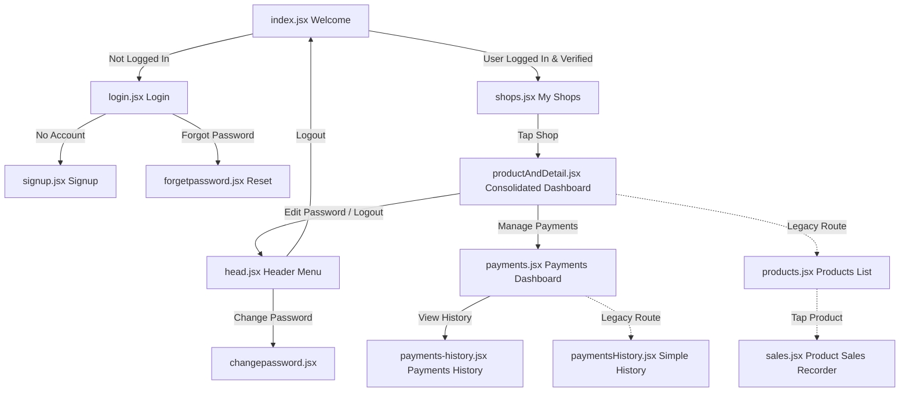
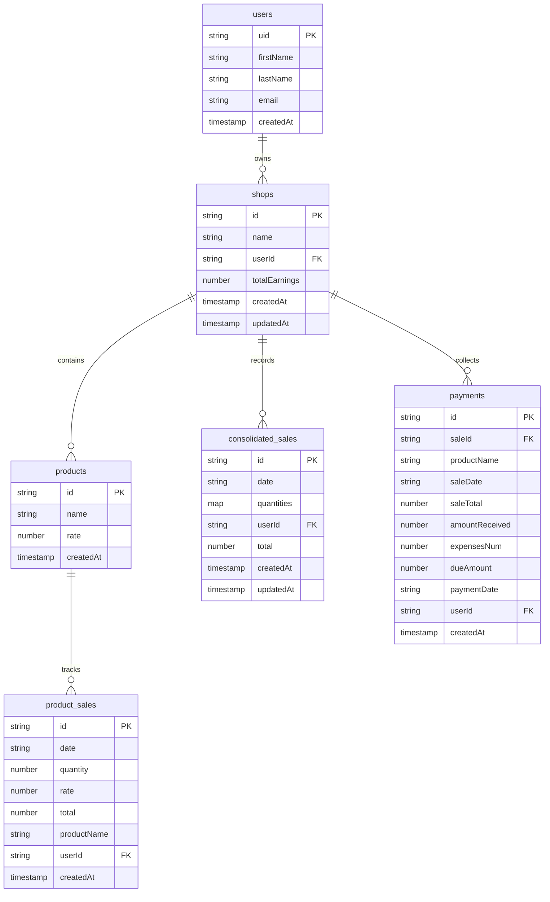

# RecordTrack Project Documentation (Brain File)

Welcome to **RecordTrack**, a modern, cross-platform React Native mobile application built with Expo and backed by Google Firebase. RecordTrack is designed to help small-to-medium business owners and shop managers effortlessly track their shops, products, daily sales, earnings, expenses, and outstanding customer dues.

This document serves as a complete reference guide for new developers, maintainers, and AI models to quickly understand the project's architecture, file structure, database schema, and dev environment setup.

---

## Table of Contents
1. [Tech Stack & Key Dependencies](#1-tech-stack--key-dependencies)
2. [Project Architecture & Routing](#2-project-architecture--routing)
3. [Detailed Screen Flow & Features](#3-detailed-screen-flow--features)
4. [Database Schema (Firestore)](#4-database-schema-firestore)
5. [Shared Layouts & Dynamic Components](#5-shared-layouts--dynamic-components)
6. [Local State & Data Sync Strategies](#6-local-state--data-sync-strategies)
7. [Getting Started & Local Setup](#7-getting-started--local-setup)
8. [Configuration Files](#8-configuration-files)
9. [Developer Guidelines & Best Practices](#9-developer-guidelines--best-practices)

---

## 1. Tech Stack & Key Dependencies

RecordTrack is constructed on a modern React Native foundation powered by **Expo SDK 52**.

*   **Core Framework**: React Native (0.76.7) & React (18.3.1)
*   **Platform & Tooling**: Expo SDK (~52.0.39) for cross-platform support (Android, iOS, Web) and native APIs.
*   **Routing & Navigation**: `expo-router` (~4.0.19) for declarative, file-based routing.
*   **Database & Auth**: `firebase` (v11.4.0) SDK for user authorization and Firestore real-time NoSQL database.
*   **UI Components**: `react-native-paper` (v5.13.1) for material design components.
*   **Animations**: `react-native-reanimated` (~3.16.1) for smooth slide, fade, and bounce micro-animations.
*   **Icons**: `@expo/vector-icons` (Ionicons, MaterialIcons, FontAwesome, AntDesign).
*   **Data Persistence**: `@react-native-async-storage/async-storage` for local credentials caching and auto-login.
*   **Date Utilities**: `moment` for format management and date pickers.

---

## 2. Project Architecture & Routing

The project uses `expo-router`, meaning the directory structure inside the `app` folder directly determines the app's routing paths:

```
RecordTrack/
├── .expo/                   # Expo cache and settings
├── assets/                  # Images, logos, and icons
├── app/                     # Main Application Source Code (Expo Router)
│   ├── components/
│   │   └── head.jsx         # Custom app bar/header with drawer menu
│   ├── _layout.js           # Navigation root configuring stack screen options
│   ├── index.jsx            # Landing / Auth-check screen (Root path '/')
│   ├── login.jsx            # User sign-in page ('/login')
│   ├── signup.jsx           # User registration page ('/signup')
│   ├── forgetpassword.jsx   # Password recovery page ('/forgetpassword')
│   ├── changepassword.jsx   # Account password modifier ('/changepassword')
│   ├── shops.jsx            # Dashboard listing user's shops ('/shops')
│   ├── productAndDetail.jsx # Consolidated product & daily sales log ('/productAndDetail')
│   ├── products.jsx         # [Alternative/Older] Individual product list ('/products')
│   ├── sales.jsx            # [Alternative/Older] Individual product sales recorder ('/sales')
│   ├── payments.jsx         # Payments & outstanding tracking ('/payments')
│   ├── payments-history.jsx # Detailed payments list with date filters ('/payments-history')
│   └── paymentsHistory.jsx  # [Alternative/Older] Simple payments history list ('/paymentsHistory')
├── App.js                   # Legacy entry point
├── app.json                 # Expo configuration file
├── babel.config.js          # Babel config (including reanimated plugin)
├── eas.json                 # EAS build configuration
├── firebase.config.js       # Firebase initialization and exports
├── package.json             # NPM dependencies and run scripts
└── README.md                # General readme file
```

---

## 3. Detailed Screen Flow & Features



### Screen Breakdown

#### 1. Welcome / Entry (`index.jsx`)
*   **Path**: `/`
*   **Description**: Serves as the landing screen. Uses `onAuthStateChanged` to verify if the user has an active, email-verified session.
*   **Logic**: Clicking "Get Started" routes the user to `/shops` if logged in and verified; otherwise, redirects to `/login`.

#### 2. Authentication Flow (`login.jsx`, `signup.jsx`, `forgetpassword.jsx`, `changepassword.jsx`)
*   **Login**: Accepts email/password. Automatically loads saved credentials from `AsyncStorage`. If authentication succeeds and the email is verified, stores credentials locally and redirects to `/shops`.
*   **Signup**: Creates a new user in Firebase Auth. Registers user details (`firstName`, `lastName`, `email`) in the Firestore `users` collection. Triggers an email verification.
*   **Forget Password**: Triggers a Firebase password reset email.
*   **Change Password**: Re-authenticates the current user using their old password and updates it to the new password.

#### 3. Shops Management (`shops.jsx`)
*   **Path**: `/shops`
*   **Description**: The primary home dashboard. Lists all shops associated with the logged-in user (`userId == currentUser.uid`).
*   **Actions**:
    *   Create a new shop document.
    *   Edit an existing shop name.
    *   Delete a shop.
    *   Tapping a shop navigates to `/productAndDetail?shopId={shopId}`.

#### 4. Consolidated Products & Sales Dashboard (`productAndDetail.jsx`)
*   **Path**: `/productAndDetail`
*   **Description**: The central operation panel for a single shop. Consolidates both product details and daily sales entries into a matrix format.
*   **Key Features**:
    *   **Manage Products**: Add products, edit product names/rates, and delete products. Rate editing can be performed inline.
    *   **Daily Sales Table**: A dynamic spreadsheet-like interface. Users select a date, and the app displays a table listing each product alongside an editable quantity input.
    *   **Consolidation**: Saves individual product sales documents under `shops/{shopId}/products/{productId}/sales` for history AND saves a consolidated daily summary under `shops/{shopId}/sales` for table rendering.
    *   **Data Pagination**: Implements server-side pagination for sales logs to ensure fast loads.

#### 5. Payments Dashboard (`payments.jsx`)
*   **Path**: `/payments`
*   **Description**: Displays a balance sheet showing sales total, amount received, business expenses, and net due amount.
*   **Calculations**:
    *   `Due Amount = (Amount Received + Expenses) - Sales Total`
    *   Tracks and modifies the parent shop's `totalEarnings` dynamically upon creating/deleting a payment entry.
*   **Actions**: Record a new payment (received amount + expenses) against a specific day's sales entry.

#### 6. Payments History (`payments-history.jsx`)
*   **Path**: `/payments-history`
*   **Description**: Lists all recorded transactions for a shop.
*   **Features**: Includes a date filter modal to isolate payments by date, calculates the total sales for the selected date, and renders detailed cards showing Received, Expense, and Due values.

---

## 4. Database Schema (Firestore)

RecordTrack relies on Firestore collections to store relational-like documents.



### Detailed Document Fields

#### 1. `users` (Collection)
*   **Path**: `users/{userId}`
*   **Fields**:
    ```typescript
    {
      firstName: string;
      lastName: string;
      email: string;
      createdAt: timestamp;
    }
    ```

#### 2. `shops` (Collection)
*   **Path**: `shops/{shopId}`
*   **Fields**:
    ```typescript
    {
      name: string;
      userId: string;          // Owner uid
      totalEarnings: number;   // Accrued earnings/dues balance
      createdAt: timestamp;
      updatedAt?: timestamp;
    }
    ```

#### 3. `products` (Subcollection)
*   **Path**: `shops/{shopId}/products/{productId}`
*   **Fields**:
    ```typescript
    {
      name: string;
      rate: number;            // Default rate/price per unit
      createdAt: timestamp;
    }
    ```

#### 4. `product_sales` (Subcollection)
*   **Path**: `shops/{shopId}/products/{productId}/sales/{saleId}`
*   **Fields**:
    ```typescript
    {
      date: string;            // ISO String date
      quantity: number;
      rate: number;
      total: number;           // calculated locally (quantity * rate)
      productName: string;
      userId: string;          // recorder user uid
      createdAt: timestamp;
    }
    ```

#### 5. `consolidated_sales` (Subcollection)
*   **Path**: `shops/{shopId}/sales/{salesEntryId}`
*   **Fields**:
    ```typescript
    {
      date: string;            // ISO String date
      quantities: {            // Keyed by productId
        [productId: string]: number;
      };
      userId: string;
      total: number;           // Combined total rate * quantity
      createdAt: timestamp;
      updatedAt?: timestamp;
    }
    ```

#### 6. `payments` (Subcollection)
*   **Path**: `shops/{shopId}/payments/{paymentId}`
*   **Fields**:
    ```typescript
    {
      saleId: string;          // ID referencing consolidated_sales
      productName: string;     // Friendly name/date of sale
      saleDate: string;        // Date of corresponding sale
      saleTotal: number;
      amountReceived: number;
      expensesNum: number;
      dueAmount: number;       // (amountReceived + expensesNum) - saleTotal
      paymentDate: string;     // Date payment was recorded (ISO)
      userId: string;          // User who recorded it
      createdAt: timestamp;
    }
    ```

---

## 5. Shared Layouts & Dynamic Components

### 1. Root Stack Layout (`app/_layout.js`)
Wraps the entire application routing stack. It sets standard header configurations (disabling default headers since screens render custom components).
```javascript
import { Stack } from "expo-router";
export default function Layout() {
  return <Stack screenOptions={{ headerShown: false }} />;
}
```

### 2. Custom Shared Header (`app/components/head.jsx`)
*   **Greeting**: Fetches the user's name from `users/{userId}` using their Auth state on mount and displays a customized greeting (`Hi there, {firstName}!`).
*   **Back Navigation**: Generic back arrow utilising `router.back()`.
*   **User Action Drawer**: Tapping the avatar slides out a menu with options to:
    1.  Change password (redirects to `/changepassword`).
    2.  Log out (signs out of Firebase, clears all locally cached credentials inside `AsyncStorage`, and redirects to `/`).

---

## 6. Local State & Data Sync Strategies

### Real-Time Sync (`onSnapshot`)
To prevent desync when multiple devices use the same shop database, critical data dashboards use real-time listeners:
*   `productAndDetail.jsx` sets up an `onSnapshot` listener on the `products` and `sales` collections. State updates are triggered automatically when changes happen on Firestore.
*   `payments.jsx` sets up `onSnapshot` listeners to sync sales logs and payment receipts.

### Server Pagination
Since querying large histories gets expensive in Firestore, the app limits read queries:
*   `SALES_PAGE_SIZE = 20` or `10`
*   Uses `startAfter` with the last retrieved document reference (`salesLastVisible`) to load subsequent batches when the user clicks "Load More" or scrolls.

---

## 7. Getting Started & Local Setup

### Prerequisites
*   [Node.js](https://nodejs.org/) (v18+ recommended)
*   [Expo CLI](https://docs.expo.dev/get-started/installation/) (`npm install -g expo-cli`)
*   [Expo Go App](https://expo.dev/go) installed on your mobile device (to preview locally without compilation), or an Android/iOS emulator configured on your PC.

### Installation
1.  Clone the repository and open the project directory.
2.  Install dependencies:
    ```bash
    npm install
    ```

### Firebase Setup
If you need to connect the app to a different Firebase instance, update the configuration object inside `firebase.config.js`:
```javascript
const firebaseConfig = {
  apiKey: "YOUR_API_KEY",
  authDomain: "YOUR_AUTH_DOMAIN",
  databaseURL: "YOUR_DATABASE_URL",
  projectId: "YOUR_PROJECT_ID",
  storageBucket: "YOUR_STORAGE_BUCKET",
  messagingSenderId: "YOUR_MESSAGING_SENDER_ID",
  appId: "YOUR_APP_ID"
};
```

### Running the App
Start the Expo development server:
```bash
npx expo start
```
*   Press **`a`** to open the app on an Android emulator/device.
*   Press **`i`** to open the app on an iOS simulator/device.
*   Scan the QR code printed in the terminal using the **Expo Go app** on Android or the Camera app on iOS to run it directly on a physical phone.

---

## 8. Configuration Files

### 1. `app.json`
Specifies app configurations including icon assets, splash images, adaptive Android icons, native package names (`com.hassan36226.RecordTrack`), active plugins (`expo-router`), and EAS projectId configuration.

### 2. `babel.config.js`
Uses `babel-preset-expo`. Requires `react-native-reanimated/plugin` plugin configuration at the end of the plugins array for Reanimated to work correctly.

### 3. `eas.json`
Defines EAS Build configurations.
*   **development**: builds a debug build configured for testing with `expo-dev-client`.
*   **preview**: internal distribution testing.
*   **production**: builds and triggers automated bundle builds. The Android build target outputs a standard `apk` installer rather than an `aab` file.

---

## 9. Developer Guidelines & Best Practices

1.  **Avoid Ad-hoc State Mutators**: Use Firestore's real-time listeners (`onSnapshot`) instead of manual optimistic state updating. For instance, when adding a shop/product, write to Firestore and let the snapshot handler update the React state.
2.  **Transactions & Calculations**: Ensure math computations (e.g. `dueAmount`, `totalEarnings` modifications) are double-checked for float rounding errors. Use `parseFloat` and conversion routines when retrieving values from text inputs.
3.  **Authentication Guarding**: Every transactional Firestore query should verify `auth.currentUser` is present. Query filters (`where("userId", "==", auth.currentUser.uid)`) should align with Firestore Security Rules.
4.  **Deprecated Screens**: Keep in mind that `app/products.jsx`, `app/sales.jsx`, and `app/paymentsHistory.jsx` represent alternative/older implementations. Ensure any modifications are centered around `productAndDetail.jsx` and `payments.jsx` unless backward compatibility or migration is explicitly requested.
5.  **Performance Patterns**:
    *   **Hooks at top level only**: Never call `useCallback`, `useMemo`, or any hook inside JSX or conditional branches — this breaks the Rules of Hooks and causes unmount/remount cycles.
    *   **React.memo at module level**: Define memoized components outside the parent function component (at module level). Defining them inside the component body defeats memoization entirely (React treats each re-creation as a new component type, causing full unmount/remount).
    *   **Stable callbacks with useCallback**: Wrap `renderItem`, `keyExtractor`, and event handlers passed to list items with `useCallback` to enable `React.memo` to function correctly.
    *   **Avoid Date/Number formatting in render**: Pre-compute `formattedDate` and `formattedTotal` fields in data listeners/useMemo. `new Date()` and `.toLocaleString()` are CPU-intensive and block the main thread on large lists.
    *   **Avoid O(n²) deduplication**: Use `new Map(items.map(i => [i.id, i])).values()` instead of `.filter()` + `.findIndex()`.
    *   **Firestore queries need composite indexes**: When combining `where("userId", ...)` with `orderBy("date")`, create the composite index in Firebase console or deploy via `firebase deploy --only firestore:indexes`.
    *   **Use `logger` instead of `console`**: Import from `./lib/logger`. In production, only `logger.error` persists; `logger.info`/`logger.warn` are suppressed.
    *   **Modal animationType**: Use `"fade"` instead of `"slide"` for faster modal display on Android. The native "slide" animation is ~300ms slower.

---

## 10. Performance Optimization Log

### Phase 0 — Firestore Composite Indexes
Created `firestore.indexes.json` with composite indexes for `sales` (userId ASC, date DESC) and `payments` (userId ASC, createdAt DESC). Updated `productAndDetail.jsx` and `payments.jsx` to use `where("userId", ...)` in all 6 query locations, removing client-side `.filter()` fallbacks.

### Phase 1 — FlatList inside ScrollView
Removed outer `<ScrollView>` wrappers in `productAndDetail.jsx` and `payments.jsx` that contained `<FlatList scrollEnabled={false}>`. FlatLists now handle their own vertical scrolling. `ListHeaderComponent` used for header sections.

### Phase 2 — Pagination + O(n²) fix (payments-history.jsx)
Replaced `getDocs` with paginated queries (`limit(PAGE_SIZE=50)`, `startAfter`, cursor). Added `dailyTotals` useMemo for O(1) daily sale lookups instead of O(n²) iteration per rendered item.

### Phase 3 — Animation Delay Reduction
Reduced stagger delays and animation durations across all 9 animated screens. Max delay reduced from 1800ms → 300ms, max duration from 800ms → 500ms. Files: `index.jsx`, `login.jsx`, `signup.jsx`, `changepassword.jsx`, `forgetpassword.jsx`, `shops.jsx`, `products.jsx`, `sales.jsx`, `productAndDetail.jsx`.

### Phase 4 — Logger Utility
Created `app/lib/logger.js` — suppresses non-error logs in production. Replaced 63 `console.log/warn/error` calls across 9 files with `logger.info/warn/error`.

### Phase 5 — Background Image Optimization
Compressed `assets/Deer.jpg` from 157KB → 15.7KB (90% reduction) by resizing to 720px width at JPEG quality 80.

### Phase 6 — Real-Time Shop Listener
Switched `shops.jsx` from `getDocs()` (one-time fetch) to `onSnapshot()` real-time listener. Removed manual `setShops` calls from add/update/delete handlers.

### Phase 7 — Data Type Fixes
- `productAndDetail.jsx`: `rate` stored as number instead of string (`parseFloat` instead of `String().trim()`)
- `signup.jsx`: `createdAt` uses `serverTimestamp()` instead of `new Date()`
- `shops.jsx`: `createdAt` uses `serverTimestamp()` instead of `new Date()`

### Phase 8 — Edit Modal Performance
- Extracted `SaleItem` (sales.jsx) and `PaymentItem` (payments.jsx) with `React.memo` at module level
- Wrapped all callbacks with `useCallback` to stabilize references
- Changed modal `animationType` from `"slide"` → `"fade"` on both screens
- Pre-computed `displayedData` with `useMemo` instead of `useEffect` + state
- Increased payments display count from 3 → 5
- Fixed Rules-of-Hooks violations (useCallback inside conditional JSX)

### Phase 9 — Audit Fixes (9 Issues)
- **H1**: Moved `SalesRow` to module level in `productAndDetail.jsx` (was defined inside component, defeating `React.memo` and causing full remount on every render)
- **H2**: Replaced O(n²) dedup (`filter`+`findIndex`) with O(n) `Map`-based dedup in `productAndDetail.jsx` and `payments.jsx`
- **H3**: Removed debug `useEffect` in `productAndDetail.jsx` that logged 4 messages on every keystroke
- **H4**: Removed duplicate `useEffect` in `products.jsx` (was calling `fetchProducts` twice)
- **H5**: Wrapped `renderItem` with `useCallback` in `products.jsx` FlatList
- **H6**: Fixed auth `useEffect` dependency on `[initializing]` in `index.jsx` (was unsubscribing/resubscribing, risking missed auth state changes)
- **H7**: Deleted 6 unused asset images (~270KB) from `assets/`
- **H8**: Removed artificial 300ms `setTimeout` in `sales.jsx` pagination
- **H9**: Removed 50ms `setTimeout` hack before modal in `productAndDetail.jsx`
- Cleaned up unused imports (`FlatList`, `ScrollView`, `React` default import) across files
